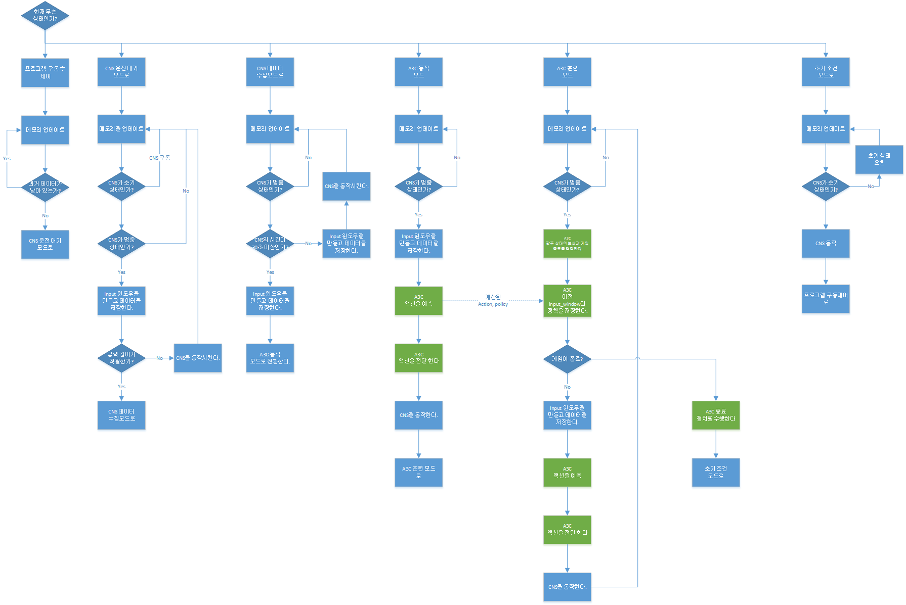

# Process_A3C
## Step 6 A3C를 구현하기 위한 CNS와 A3C 더미 모델간 공유

- 필요성:
    - A3C의 네트워크는 2개로 이루어져 있다. actor와 critic이다.

- 학습
    1. 출력 값을 분할한다.
    2. 다중 CNS와 데이터 통신을 한다.
    3. 개별적 네트워크에서 CNS를 조작 신호, 초기화 신호 및 동작 신호를 전달한다.
    
- 로직
    - 로직 그림
    
    전체적인 CNS를 초기화 시키고 동작시키는 것에 대한 로직 다이어그램이다. 이를 통해서 어느 파트에 필요한 함수가
    들어가는 것인지 파악하자. (* 실제 코드와 다르게 메모리 로드하는 부분은 공통사항이라 while 맨위에 작성했다.)
    
    
    
    
- 부족사항
    - Thread 로 동작하지 말고 멀티프로세스에서 돌리고 싶으나 잘 안되는 것이 실정.

- 주의사항
    - CNS_10_21.tar 기반의 CNS에서 구동되며, 초기 값은 CNS 2개를 구동시켜야 코드가 원활하게 구동된다.
   
- Ref
    - 없음
   
### 코드 목록 및 소개
- Main.py
    - 코드의 시작 및 멀티프로세스의 시작
    
- A3C.py
    - A3C 에이전트가 들어있는 부분
    
- A3C_NETWORK.py
    - A3C 에이전트의 네트워크 모델이 들어 있는 부분    
